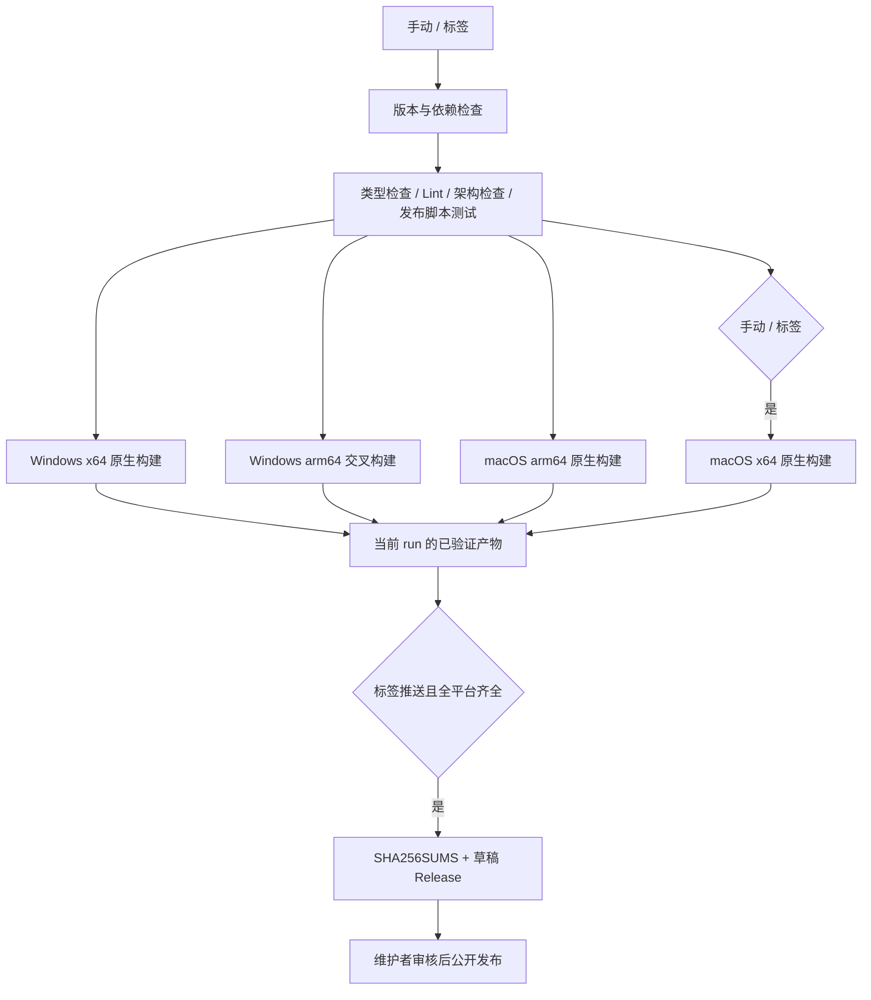

# 桌面 CI 与草稿发布

## 范围与产品规则

- 桌面构建矩阵仅覆盖 Windows x64/arm64、macOS arm64/x64；Windows arm64 在 x64 runner 上交叉打包，其他目标使用 GitHub 托管的原生 runner。
- 手动运行和 `v*` 标签推送均执行检查、Windows 打包与 macOS arm64 打包；macOS x64 只在标签推送时构建（手动运行构建 arm64）。Ubuntu 只用于检查与草稿资产上传，不构建 Linux 安装包或远端运行资源。
- 构建工作流仅 `desktop.yml` 一个：只在手动运行和 `v*` 标签推送时执行（2026-10-09 起，GitHub 会因 fork 的 Actions 用量停用 Workflows），上传 `desktop-*` 产物，不创建 Release；历史上独立的 `macos.yml`/`zcodium-macos-arm64` 已删除。
- Windows 沿用 NSIS exe；macOS 只发 dmg，打包目标、产物收集与发布校验必须一致，不要求或上传 zip。四个目标的架构名均为 x64 或 arm64。
- Linux 目标在桌面打包入口和资产收集入口明确拒绝；发布校验只要求四个 Windows/macOS 安装包，Linux 文件作为额外资产阻断发布。
- 不再构建、下载、校验或嵌入 `bundled-remote-assets`，桌面开发态也不读取历史 Linux 资源。SSH/WSL/Linux 容器远程工作区部署明确报缺少运行资源；通用 Server/CLI 的平台实现保留，手机远控继续复用本机 Host，与 Linux 远程工作区独立。
- 只有版本标签推送允许创建 GitHub **草稿** Release，公开发布由维护者审核后操作。
- 带预发布标识的版本同时标记为 prerelease，审核发布时不会被误当作稳定版本。
- 标签必须为 `v<package.json.version>`，版本需满足 SemVer（可带预发布标识，不接受 build metadata）。无效标签在构建前失败。
- 依赖安装使用 frozen lockfile。Node 从 mise.toml、pnpm 从 package.json 读取；同步已有依赖遗漏的锁文件项，不升级业务依赖。
- 工具链读取器显式解析 mise.toml 的 tools 表，只接受固定版本，并验证 pnpm 与 packageManager 一致；缺失或不一致时在安装前失败。
- 构建只使用当前源码与仓库已有资源，不读取 references/，不需要官方账号、服务凭据、私有镜像或签名证书。
- 本 PR 不迁移技能、不新增 CUA 原生实现、不配置应用内自动更新；现有账号及遥测代码的全面移除另行实施。

## 所有者、接口与事件顺序

GitHub Actions 工作流拥有调度和权限；现有 `bundle:desktop` 拥有构建、运行时依赖验证与体积审计；发布脚本只拥有产物筛选、校验和及草稿上传，不复制业务状态。

- 检查与构建仅 `contents: read`；仅标签发布 job 拥有 `contents: write`，token 只在上传步骤注入。
- checkout 不保留凭据；不使用 pull_request_target，不使用 PR 输入拼接 shell 命令。
- 手动运行与标签推送仅上传 Actions artifacts；构建阶段显式禁止 electron-builder 自动发布。
- macOS 构建复用同一 job 与打包入口，由触发事件选择架构矩阵；普通 PR/main 只选择 arm64，手动/标签选择 arm64 与 x64。每个架构只使用对应的原生 runner，不交叉打包。
- Checks 结束后，即使检查失败也执行未取消的打包任务，以独立暴露构建错误；当前 run 被取消时不继续打包。自动产出安装包不等于自动安装，仍由用户选择何时覆盖本地应用。
- 同一 ref 的普通构建允许取消旧运行；标签发布串行且不取消在途运行。
- 发布仅消费当前 run 的固定 artifact。任何平台缺失、错误版本、空文件或额外文件均拒绝上传。
- SHA256SUMS 由最终下载后的文件生成。重跑仅可更新同标签草稿；已公开 Release 拒绝覆盖。
- 发布 job 是 Release 的唯一写入者；失败不会自动发布。上传中断可能留下草稿，重跑覆盖同名草稿资产。

## 验收场景

1. 手动运行即可获得 Windows 与 macOS arm64 构建；不触发 macOS x64 构建或发布。push/PR 不再触发任何构建（fork Actions 用量停用纪律）。
2. 各平台独立产生所有预期安装包，并通过已有 app.asar 运行时依赖校验。
3. 手动运行与合法标签推送选择完整的 Windows/macOS 四架构矩阵；标签上下文的手动运行仍不创建 Release。
4. 合法标签、全平台构建与检查全部成功后，只生成草稿及 SHA256SUMS；维护者仍须手动发布。
5. 版本不匹配、单平台失败、缺包、错版本和空包阻断发布；重跑不能覆盖公开 Release。
6. 发布辅助脚本用临时目录和模拟 GitHub 调用测试，覆盖以上失败语义，不访问真实 Release。
7. Windows/macOS 的 x64 与 arm64 产物分别收集；Linux 打包和资产收集请求在启动构建或写文件之前失败。
8. Windows x64 runner 执行 CUA 原生库与打包后 Electron 运行时探针；Windows arm64 交叉打包只校验随包资产文件（`--files-only`）。
9. 执行 typecheck、lint、架构检查以及工作流语法验证；已有失败或环境限制如实记录，不降级门禁。
10. macOS arm64/x64 各自只需一个非空 dmg 即可收集，其他架构及 zip 不进入输出；发布目录中的 zip 作为额外资产阻断发布。
11. 删除历史 `bundled-remote-assets` 后，Windows/macOS 的准备和打包入口不要求 Linux manifest，仍校验本机 Agent、插件与原生库；手机远控的 `web-remote` 继续随包分发。
12. 准备入口回归使用明确的目标平台 fixture，不从运行检查的 Ubuntu/macOS 宿主推断桌面目标；macOS 和 Windows 分别验证子命令，不执行真实资源构建。
13. Gen UI 的 runtime/vendor 清单校验原始文件 SHA256。Git 检出必须按字节保存这些资源及 tweak 运行时，Windows `core.autocrlf=true` 也不能修改换行；不得通过重算清单、归一化待校验字节或跳过校验来放行变更。
14. 打包后 source map 清理由既有脚本负责；普通构建代码继续清理引用和 `.map`，但不得改写 renderer `out/plugin-sandbox/vendor` 或 Agent `glm/packages/visualize-plugin/skills/visualize/assets/vendor` 的固定快照。最终安装包中的 vendor 和许可文件必须仍匹配原始清单 SHA256。

## 检查阶段的源码测试

Checks 中的诊断回归直接读取受检源码，不依赖 CLI package 的 `dist`、历史 bundle 或本地增量构建缓存。诊断测试入口共用独立 tsconfig，将需要的 `@zcode/contracts` 公共入口解析到契约源码，并保留 UI 的 `@/*` 源码别名；静态与测试执行时的动态导入使用同一配置。不修改生产 package exports，也不为测试加载整个 CLI 构建流程。

验收：隐藏全部 CLI workspace 构建输出后，使用与 CI 相同的 `node --test --test-isolation=none scripts/ci/*.test.mjs` 执行，必须实际加载全部诊断子用例；导入失败不能算作未执行的成功测试。

## 发行边界

- 桌面、远端和首启 seed 清单保持一致，只分发源码资源完整且满足 seed 契约的插件，不降低资源校验要求。
- CUA 原生运行时按目标 platform/arch 落盘（`@trycua/cua-driver-<platform>-<arch>`），交叉打包不得把构建机架构的原生库带进安装包。
- Windows/macOS GUI 启动和安装体验需在真实目标环境验证；静态检查与脚本测试不能替代安装验收。

## 本地集成构建

- 桌面与本机 Agent 从当前工作树生成；不使用上游 Linux 远端制品替代 fork 的数据目录、迁移与业务修复。准备入口只生成目标 Windows/macOS 的本机运行资源。
- 本地打包需用户明确要求；仅执行代码修复或配置检查时，不生成安装包、不覆盖已安装应用。未获推送授权时不通过推送启动 GitHub 构建。
- 已移除的桌面灰度模块不能保留启动回调。正式包启动检查显式隔离业务数据、Electron userData/session 和默认工作区目录。
- Gen UI 进程测试从数据目录常量构造预期路径；MCP App 使用现有沙箱输入的默认类型，只有 Gen UI 输入声明 `contentKind: "gen-ui"`，不扩大生产接口来迁就测试。
- 常规根类型检查未覆盖 Electron main；本地集成额外检查 main，并区分原有基线错误与本次新增错误。回归、功能测试和启动检查分别报告实际结果。

## 参考

- [setup-node](https://github.com/actions/setup-node)：按 mise.toml 安装 Node。
- [pnpm/action-setup](https://github.com/pnpm/action-setup)：按 packageManager 安装 pnpm。
- [upload-artifact](https://github.com/actions/upload-artifact) / [download-artifact](https://github.com/actions/download-artifact)：同一工作流内传递产物。

## 构建阶段避免重复准备

`bundle:desktop` 显式执行 `prepare:runtime-assets` 后调用 `build:no-runtime-assets`。只有 `--skip-prepare` 且未跳过构建时调用完整 `build`，由它负责准备。保留现有 Windows/macOS 目标、本机 Agent 与原生资源校验，不恢复 Linux 资源步骤。回归覆盖普通、skip-prepare、skip-build 及同时跳过两阶段的调用顺序，不执行真实打包。
