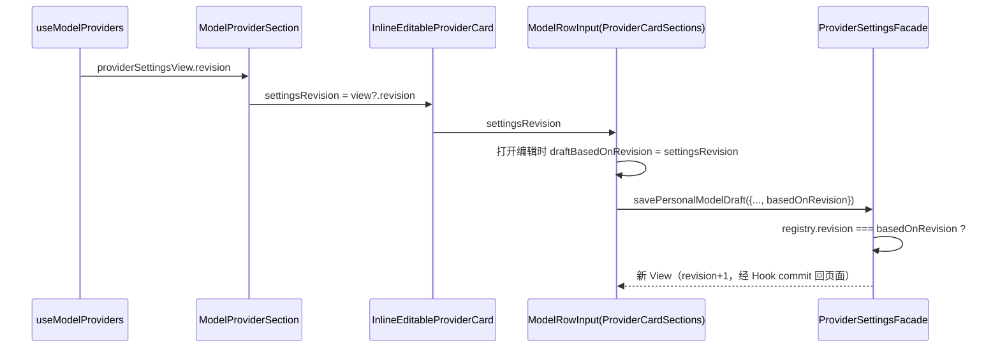

# 模型配置编辑保存的 revision 传递

## 产品规则

设置页「编辑模型配置」保存走 `savePersonalModelDraft`，该操作在主进程按 revision 做乐观并发校验：前端必须提交打开编辑时的注册表 revision，否则注册表 revision ≠ 0 时（启动后第一次重建即 +1，此后恒非 0）保存必然被拒绝。

- 提交的 `basedOnRevision` 必须来自当前权威 `ProviderSettingsView.revision`，不能是写死的常量；编辑事务打开时锁定 revision，保存期间不跟随视图刷新重置（`ProviderFormControls` 既有语义）。
- 添加模型、启停、删除、重排走快照同一性校验，不经 revision 比对，本 spec 不约束。
- 视图未就绪（loading / error）时设置页不渲染可编辑卡片，此时不存在编辑事务，不提供「revision 缺省 = 0」的兜底。

## 所有者与接口

- `packages/ui/src/hooks/useModelProviders.ts`：`providerSettingsView` 的唯一出口，含 `revision` 字段；设置页从此取值，不另建状态。
- `packages/ui/src/settings/ModelProviderSection.tsx`：渲染 `InlineEditableProviderCard` 时必须传 `settingsRevision={providerSettingsView?.revision}`；老 `Detail.tsx` 的等价传递（`settingsRevision: providerSettingsView?.revision`）在 968a868 重构中删除，本 spec 固化重构后的传递责任。
- `packages/ui/src/settings/model-provider-section/InlineEditableProviderCard.tsx`：接收 `settingsRevision` 并透传 `ProviderModelsSection`；`?? 0` 仅为类型兼容的防御值，设置页不依赖它。
- `packages/provider/src/facades.ts` `savePersonalModelDraft`：revision 比对与拒绝的权威实现，报错文案 `Provider Settings revision conflict: expected N, current M`。

## 验收

1. 注册表 revision ≥ 1 时编辑模型并保存成功，不再出现 `Provider Settings revision conflict: expected 0, current N`。
2. 保存后再次编辑仍成功（每次成功保存使 revision +1，页面视图同步刷新）。
3. 旧版本构建（断链时）该路径必失败；本修复仅恢复传递链，不改动 facade 校验语义。
4. `scripts/ci/self-managed-models-smoke.mjs` 的 walkthrough 覆盖「编辑已有模型 → 保存」并断言提交的 `basedOnRevision` 与服务端 revision 一致。
