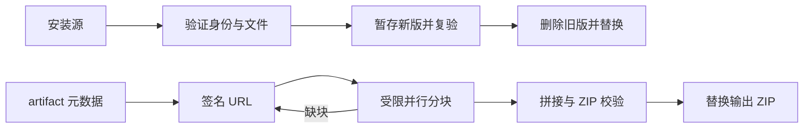

# 仓库维护与本机安装边界

## 范围与所有者

工作区的 `fetch-artifact.sh` 拥有一次 artifact 下载；`install-zcodium.sh` 拥有一次本机覆盖安装。脚本不调度构建，不安装 Linux 资源，不保存旧版备份，不改业务数据目录。仓库检查入口仅负责执行检查，包管理器版本由根 packageManager 声明拥有。

## 安装与下载

- 安装先验证源 bundle 的正式产品身份、版本、arm64 可执行文件和 app.asar；源等于已安装路径时拒绝。新版暂存在目标父目录，复制和验证成功后才删除旧版并替换，不生成旧版备份。任何验证或复制失败返回非零，清理本次暂存内容。
- 下载仅接受正整数 artifact ID；读取 artifact 元数据确认仅为 macOS arm64 产物。先取得有效签名 URL 和正整数大小，再创建本次临时分块目录，不先删除已有 ZIP。
- 16 路、8 MiB 分块；每轮失败后刷新签名 URL，仅重试缺失或错误大小的分块。网络请求有连接/总时限与低速限制，URL 不落日志。
- 完整拼接、大小与 ZIP 完整性校验通过后才替换输出 ZIP。退出或中断要等待/终止本次 worker 并清理本次临时目录，不清理用户已有目录。

## 检查与整理

- CLI typecheck 从根 workspace 调度目标包，通过 corepack 固定 pnpm，避免子 workspace 缺少 turbo 或启动全局 pnpm；Lint 由根目录检查器枚举 CLI 直接子包的 src 和既有 debug/test 目录，使用根安装的 oxlint；CLI Lint 检查所有包（失败后继续检查，最终非零退出），继承根规则但清除根目录对整个 CLI 的忽略，避免零文件假通过；嵌套 pretypecheck 也使用 corepack。不本地打包桌面客户端。
- 路径断言比较真实路径，保留运行时对软链接入口的解析行为。
- README 中文正文仅保留一份，中英文版本规则以实际 package.json 为准。依赖清理只删除确认无代码、资源或构建引用的项，不照搬 knip 的候选清单。
- 清除未使用导入和纯局部变量；公开接口参数和 props 契约保留。保留订阅/迭代快照、输入过滤、错误首因等有意行为，不为消除 warning 改变语义。
- 与上游逐字节相同的格式问题保留；仅格式化本次文件及已有 fork 文件。清理的旧打包产物限定于 `packages/desktop/dist`，不删除源码、用户数据、Agent dist 或 node_modules。

## 验收

- 安装的无效源、复制失败与复验失败均不能删除旧版；成功覆盖不产生备份；最终验证失败返回非零。
- 下载覆盖无效 ID、错误 artifact、无效大小、失效 URL 刷新、部分分块失败、ZIP 校验失败与中断，失败保留旧 ZIP且无残留 worker。
- macOS provider 测试在软链接临时目录下通过；CLI 检查入口可在根及子 workspace 执行。
- 根和 CLI 类型/Lint、架构检查、CI 测试与改动文件格式检查记录真实结果。
