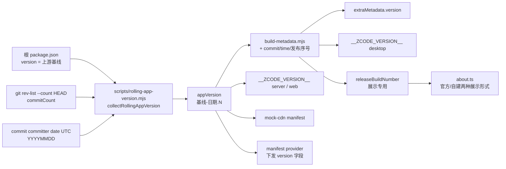

# ZCodium Exp. 滚动更新（无发版版号）

## 背景与问题

ZCodium Exp. 当前沿用上游 ZCode 的发版制版本机器：根 `package.json` 的 `version` 经
`scripts/rolling-app-version.mjs` 统一派生版本串，经 `build-metadata.mjs` 注入 `extraMetadata`
与 `__ZCODE_VERSION__`（桌面 / server / web 四处注入点同源），
配套 `release-it` 打 `v*` tag、CHANGELOG 按版本分段、CI 只在 tag 触发，`autoUpdater.ts`
围绕 semver 比较、按版本号跳过、按版本号存取 release notes，`forceUpdateGuard.ts` 读上游
`minimalVersion` 门禁。

对本仓库这些机制没有消费者：没有下游依赖版本号，没有用户以版本号标识构建，数据迁移认的是
schema 而非产品版本，上游发版节奏也不等于本仓库节奏。版本号作为"有意义的人造物"已经消失，
只剩"semver 合法字符串"这一类型约束（electron-updater 的 `AppUpdater` 构造函数同步解析
`app.getVersion()`，非法直接抛 `ERR_UPDATER_INVALID_VERSION`；Windows helper 强校验 `x.y.z`）。

结论：采纳 Arch 式滚动更新——**用户面不存在版本号概念，内部只保留一个无人维护、构建期自动
派生的单调构建标识**。

## 产品规则

### 版本方案

完整版本串为 `<上游基线>-<YYYYMMDD>.<commitCount>`，例：`3.14.3-20261008.1234`。

- **上游基线**：根 `package.json` 的 `version` 字段，仅在同步上游发布时修改，**只升不降**。
  已发布过的基线禁止回退——semver 判定 `3.14.3-20261009.1` 大于 `3.15.0-20261008.3`，
  回退基线会让新构建被 updater 判旧（见"验收"）。
- **日期段**：commit 的 committer date（UTC），`YYYYMMDD`。
- **commitCount**：`git rev-list --count HEAD`。本地可复现、全局单调、不依赖 CI 编号。
- 单调性全部由破折号后的 prerelease 段承担。**禁止把日期/序号放进 `+` build metadata**：
  semver 优先级比较忽略 build metadata，updater 看不见变化。

### 版本串是 commit 的纯函数

日期段取 committer date 而非构建时刻：同一 commit 在任意时间、任意 CI job（remote-assets /
build / collect）派生出的版本串必须一致。三处消费依赖这一点——

1. electron-builder `beforePack` 用 `context.packager.appInfo.version` 与 bundled-remote
   manifest 的 `appVersion` 做**相等**校验（`parseBundledRemoteManifest`）；
2. `scripts/ci/desktop-release.mjs collect` 按版本串匹配 electron-builder 产物名；
3. `scripts/prepare-prebuilds.mjs` 写 mock-cdn manifest 时用同一版本串。

三处都经 `getBuildMetadata()` 读取，不存在第二个版本来源。`check-version` 与 tag 发布路径
仍读根 `package.json` 的上游基线（该路径随"删除 tag 触发"一并退役）。

### 浅克隆禁令

`actions/checkout` 默认 `depth=1`，浅克隆里 `rev-list --count HEAD` 恒为 1，同一天不同
commit 会派生相同版本串，updater 漏推更新。CI 全部 checkout 必须 `fetch-depth: 0`
（`.github/workflows/desktop.yml` 已加）；`rolling-app-version.mjs` 检测到浅克隆时显式告警，
不静默产出撞号版本。非 git 检出（源码 tar 包）回退 `ZCODE_COMMIT_COUNT` 或 `0`。

### 用户可见面

- 任何界面不展示内部版本串，也不展示"版本号"概念：About 页、应用菜单更新项、更新弹窗、
  设置页均不出现 `3.14.3-20261008.1234` 或其简化数字形式。
- 需要向用户传达构建信息时，展示从构建期注入的展示字段派生的人类形式，**官方发布构建**与
  **用户自建构建**展示不同内容：
  - 官方发布构建（CI 产出）：`2026-10-08 · 构建 #4382`。`#N` 是发布流水线序号，只增不减，
    回答"我是不是最新"比日期更直接。
  - 用户自建构建（本地/ fork 构建）：`2026-10-08 · a1b2c3d4`。短 commit id（8 位，取自现有
    `buildCommitId`），自建构建没有发布流水线序号，commit id 可直接定位源码。
- 展示字符串与内部标识符是两个东西：前者可以随时改，后者不可。

### 无发版事件

- 不存在"发版"这个动作：没有版本 bump 提交、没有 `v*` tag、没有按版本组织的 CHANGELOG。
- 构建由 main 推送与手动触发驱动；`git log` 即唯一历史。

### 比较禁令

- 任何模块不得把内部版本串与上游裸 `x.y.z` 做大小比较。`forceUpdateGuard` 的上游
  `minimalVersion` 门禁因此废弃——同 core 时带 prerelease 的构建永远判"更旧"，门禁会误触发。
- 上游版本号只作为字符串基线存储与展示，不参与任何比较运算。

## 所有者与接口

### 版本派生（唯一入口）

`scripts/rolling-app-version.mjs`（仓库根，中立位置，桌面 / server / web 构建配置共同引用）：

- `collectRollingAppVersion()` 返回 `{ appVersion, upstreamBaseline }`；`formatRollingAppVersion`
  是纯拼装函数，单调性不变量由它的测试钉住。
- 基线读根 `package.json`，日期取 commit committer date，count 取 `git rev-list --count HEAD`。
- 消费方：`packages/desktop/scripts/build-metadata.mjs`（桌面身份，叠加 `buildCommitId` /
  `buildTime` / `releaseBuildNumber` 后落盘 `out/metadata/build-meta.json`，供 tsup / vite /
  electron-builder `extraMetadata.version` 读取）、`packages/server/build-remote.ts` 与
  `packages/server/tsup.config.ts`（`__ZCODE_VERSION__` 注入，server `--version` 与部署校验读它）、
  `packages/web/vite.config.ts`（web 端同一注入）。
- 不存在第二条版本来源：任何构建配置再读根 `package.json` 的 version 当产品版本都是缺陷。

### 消费方（只读，不随本 spec 改变接口）

| 消费方                                                  | 现状                                          | 滚动后                                                                           |
| ------------------------------------------------------- | --------------------------------------------- | -------------------------------------------------------------------------------- |
| `packages/shared/src/version.ts`                        | 注入值原样导出 `ZCODE_VERSION`                | 不变，值变成滚动串                                                               |
| `packages/desktop/src/main/about.ts`                    | About 页 `version` 字段                       | 不再作为"版本"展示；`releaseBuildNumber` 非空展示官方形式，为空展示自建形式      |
| `packages/desktop/src/host/index.ts`                    | `appVersion` 透传                             | 不变                                                                             |
| `packages/desktop/src/main/exportLogs.ts`               | 导出包内 `appVersion`                         | 不变                                                                             |
| `packages/desktop/src/main/desktopRuntimeEnv.ts`        | `ZCODE_APP_VERSION_ENV`                       | 不变                                                                             |
| `packages/desktop/src/main/windowsChromeAppBoundKey.ts` | `expectedAppVersion`                          | 不变                                                                             |
| `scripts/prepare-prebuilds.mjs`                         | `mock-cdn/releases/<version>/manifest-*.json` | 目录名与 `appVersion` 用滚动串                                                   |
| `scripts/bundle-remote-assets.mjs`                      | `releases/<version>` 目录名与 verify 版本串   | 同源读 `getBuildMetadata`，不再读 package.json                                   |
| `scripts/ci/remote-assets-smoke.mjs`                    | server `--version` 比对                       | 同源读 `getBuildMetadata`                                                        |
| `packages/server/build-remote.ts` / `tsup.config.ts`    | `__ZCODE_VERSION__` 注入                      | 同源读 `collectRollingAppVersion`，server 报滚动串                               |
| `packages/web/vite.config.ts`                           | `__ZCODE_VERSION__` 注入                      | 同源读 `collectRollingAppVersion`，web 报滚动串                                  |
| `scripts/ci/desktop-release.mjs`                        | `collect` 按版本串匹配产物名                  | `collect` 读 `getBuildMetadata`；`check-version`/tag 路径仍读基线（随 tag 退役） |

### 发布序号（展示专用，不进版本串）

- 官方发布构建由 CI 注入发布序号 `N`（建议取发布流水线自身的 run number，不写回仓库、不引入
  counter 文件）。构建期环境变量 `ZCODE_RELEASE_BUILD_NUMBER` 注入 `build-metadata.mjs`，
  产出 `releaseBuildNumber` 字段；本地构建该变量为空，`releaseBuildNumber` 为 `null`。
- **`N` 禁止进入内部版本串。** 版本串的 prerelease 段对全部构建必须是同一套序列
  （commitCount）：发布序号量级远小于 commitCount，混入会让自建构建永远判新、官方构建永远
  推不到自建用户手上（semver 数字标识按数值比较，`5000 > 4382`）。
- `about.ts` 是展示形式的唯一所有者：`releaseBuildNumber` 非空 → 官方形式，为空 → 自建形式。

### 现成兼容、无需改动的校验

- `scripts/ci/desktop-release.mjs` 的 `versionPattern` 本就是
  `^N.N.N(-id(.id)*)?$`，滚动串直接通过。
- `packages/desktop/scripts/build-windows-browser-import-helper.mjs` 的
  `split("-", 1)[0]` 取前缀填 `AssemblyVersion`/`AssemblyFileVersion`，正则允许 `-后缀`。
  已知瑕疵：同基线的所有构建在 Windows"程序和功能"里显示同一 `3.14.3.0`，产物文件名带完整
  版本串所以可区分，记录在案不处理。

### 各平台包管理器的版本切分

debian/rpm/pacman 均按第一个 `-` 切成 `ver-rel`，各自比较算法对 `20261008.1234` 单调，
无需适配（已按 dpkg/rpm/pacman 语义核实）。

## 分期

### 阶段 1：版本派生与去版本号展示（部分完成）

已落地（PR #38 / #39 / #41）：

- `scripts/rolling-app-version.mjs` 上线，桌面 / server / web 四处 `__ZCODE_VERSION__` 注入点
  与 mock-cdn、collect 全部切到同源读取；日期段取 commit committer date，CI 全 checkout
  `fetch-depth: 0`。
- About 页展示构建信息（官方 `构建 #N` / 自建短 commit id），不出现内部版本串。
- preview 产品身份改名 ZCodium Rust（appId 不变）。

**CI 发版制已恢复（PR #42 revert #40，2026-10 用户决策）**：一次砍掉整套发版流程动静过大，
`tags: ["v*"]` 触发、Draft release job、tag 专属 macOS 条件、`desktop-release.mjs` 的
`publish` / `validateTag` / `verifyReleaseAssets`、release-it 配置与依赖、CHANGELOG 版本分段
全部恢复原状。因此以下两项**不再是本 spec 的范围**，保持发版制现状：

- ~~删除 release-it / `release*` 脚本 / CHANGELOG 版本分段~~（已恢复）
- ~~CI 改 main 推送即构建、删 tag 触发~~（已恢复）

恢复时已修补的兼容点：`publish` 的 `verifyReleaseAssets` 与 `collect` 同源读
`getBuildMetadata()`——产物名带滚动版本串而 tag 只标识上游基线，不同源会按基线名找不到产物。

### 阶段 2：更新状态机简化

- 删除 `skippedElectronUpdateVersions` 及其"跳过此版本"入口与持久化；滚动流里没有"一个版本"
  可跳，只有"暂不更新"。
- `pendingPostUpdateReleaseNotes` 的语义从"某版本的发布说明"改为"某构建的变更说明"，key 用
  完整版本串，丢弃判定（`shouldDiscardStalePendingReleaseNotes`）继续按版本串比较，逻辑不变。
- 废弃 `forceUpdateGuard.ts` 的上游 `minimalVersion` 门禁；`ZCODIUM_UPDATE_ORIGIN` 为空时
  的行为不变（直接放行，见 `update-source-ownership.md`）。
- 更新提示文案去掉版本号位（"发现新版本 3.14.3" → "有可用更新"）。

### 阶段 3：阻塞项（另行 spec，不在本文件范围）

- macOS 代码签名与自动更新可用性（`update-source-ownership.md` 阶段 2）。签名落地前 macOS
  渠道升级方式仍是重新构建覆盖安装；滚动更新对该渠道不生效。
- stable / preview 双渠道：**已决策——保留 preview 渠道**，作为提前于 stable 的同一条滚动流；
  preview 的产品身份在这个阶段改名为 **ZCodium Rust**（见 `desktop-product-identity.mjs`，
  appId 不变以保留与既有 preview 安装的升级连续性）。

## 验收

- 同一 commit 连续构建两次，版本串相同，updater 判定无更新；新 commit 构建版本串更大，
  updater 判定可更新。
- remote-assets job 生成的 bundled-remote manifest 与 build job 的 `appInfo.version` 一致
  （`beforePack` 相等校验通过）；collect 能找到全部产物。
- 同步上游 bump 基线后，新构建版本串大于 bump 前所有构建。
- 全部用户可见界面不出现版本号字符串；About 展示构建日期与上游基线。
- main 推送触发完整构建与产物收集，不依赖 `v*` tag。
- CI 构建的 About 页展示官方形式（日期 + 构建 #N）；本地构建展示自建形式（日期 + 8 位短
  commit id），两者都不出现内部版本串与"版本号"字样。
- 日志、导出包、`ZCODE_APP_VERSION_ENV`、mock-cdn manifest 中的版本均为滚动串。

## 非目标

- 不解除 macOS 签名阻塞；不改变签名前的 macOS 升级方式。
- 不决定 stable/preview 渠道存废。
- 不改上游对账（`upstream-parity-audit.md`）引用上游版本的方式；上游基线照记。
- 不改 `ZCODE_*` 环境变量名、代码标识符、日志 scope 与磁盘命名空间。
