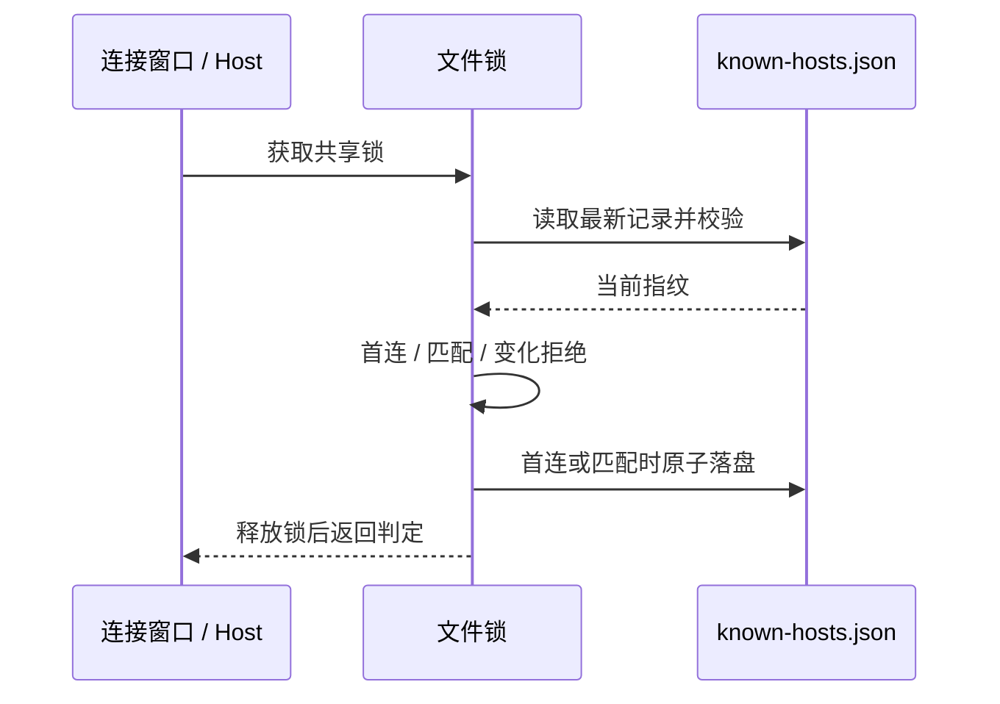
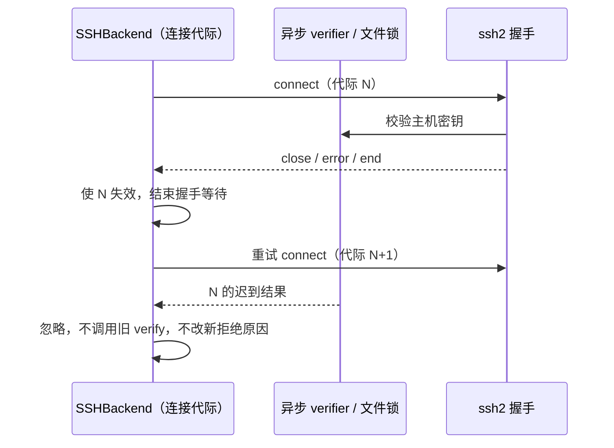

# SSH 远端连接的两项遗留缺陷

> **状态：缺陷 1 已实现（TOFU 主机密钥校验）；缺陷 2 未实现，待排期。**

## 背景

`packages/server/src/remote/` 下的 SSH 远端连接有两项遗留问题，均在 `axiom-desu/ZCodium`
主线代码中核实过。缺陷 1 已按下方「实现」落地，缺陷 2 仍开放。

## 缺陷 1：SSH 不校验主机密钥（安全）

### 现状

`packages/server/src/remote/sshAuth.ts` 的 `buildSSHConnectConfig()` 构造 `ConnectConfig` 时
**没有设置 `hostVerifier`**：

```ts
return {
  host: input.host,
  port: input.port ?? 22,
  username: input.username,
  // …privateKey / passphrase / password / agent / readyTimeout / keepalive / tryKeyboard
};
```

全仓检索 `hostVerifier` 在 `packages/` 下 0 命中（`ssh2` 的类型定义见
`node_modules/ssh2/ssh2.d.ts:726`，确认这是可选字段）。

### 后果

`ssh2` 未提供 `hostVerifier` 时接受**任意**主机密钥，即连接不对服务端身份做任何校验。
中间人可以冒充目标主机完成密钥交换，用户输入的密码 / 私钥口令会直接交给冒充者。
对于会执行任意命令的远端 Agent 部署链路，这等同于把凭据暴露给主动攻击者。

### 实现（缺陷 1，已落地）

- `packages/server/src/remote/sshKnownHosts.ts`：TOFU 存储与判定。
  - 存储位置：`getAppConfigDir()/ssh/known-hosts.json`（`<数据根>/.zcodium/v2/ssh/`，
    新目录首次使用自动创建，不涉及既有数据迁移）。
  - 存储键沿用 `buildSshRemoteHostKey()`，已知其排除密码与私钥口令；落盘内容经测试断言
    不含任何凭据。
  - 指纹：`sha256(原始主机公钥)` hex，随记录一起落库。
  - 判定：无记录 → 接受并落库；匹配 → 接受并刷新 lastSeenAt；不一致 → 拒绝且**不覆盖**
    已有记录。锁、读取、解析或首连写入故障一律 fail-closed 拒绝；已匹配指纹时仅刷新
    lastSeenAt 失败仍可接受（首连写不进去就无法在下次发现变更，不能静默失去保护）。
  - `createSSHHostVerifier` 生成 ssh2 的 `hostVerifier`；拒绝时先经 `onRejection` 记录
    可区分原因（`changed` / `store-error`）再回调 `verify(false)`——ssh2 对 `verify(false)`
    只抛固定的 `Host denied (verification failed)`，不记录就分不清两类原因。
- `packages/server/src/remote/sshAuth.ts`：`buildSSHConnectConfig` 新增 `hostVerifier`
  入参（不透传等于回到缺陷）；`normalizeSSHConnectError` 增加 host denied 兜底文案，
  不断言密钥变更（那需要 verifier 的证据）。
- `packages/server/src/remote/ssh-backend.ts`：每次连接注入 store + verifier；`onClientError`
  优先用 `formatHostKeyRejectionError` 把拒绝原因换成可操作的产品错误。
- 测试：`sshKnownHosts.test.ts` 19 例，覆盖三方判定、记录不覆盖、凭据不进存储、
  损坏 / schema 不兼容 fail-closed、verifier 回调顺序与错误文案区分。

### 未定项的消解

- **存储位置**：随应用配置根，见上。
- **逃生开关**：按原倾向不提供。
- **`sshConfigAlias`**：核实该字段只用于 `openInEditor.ts` 的 VSCode remote authority
  字符串，不进入 ssh2 连接链路（ssh2 本身不读 `~/.ssh/config`），存储键即实际连接目标，
  无需特殊处理。

### 仍未覆盖（后续）

- 首连的信息性 UI 提示与密钥变更的阻断式确认弹窗。当前首连静默接受并落库，变更拒绝以
  连接错误形式透出——安全判定已闭环，展示层待补。

## 缺陷 2：跨窗口并发部署（并发）

### 现状

`packages/desktop/src/host/index.ts:1270` 对 SSH 目标使用 `caller-serialized` 锁模式：

```ts
params.target.kind === "ssh" ? "caller-serialized" : "remote",
```

该模式在 `packages/server/src/remote/deploy.ts:274` 中**跳过远端 install-root 锁**，
理由是「桌面 SSH 已由窗口级 shared Host readiness 保证同一 target 只有一个部署事务；
若仍创建 remote lock-holder，会为无额外互斥收益的路径长期占用 SSH channel」。

### 核实结论：该声明只在单窗口内成立

单飞机制确实存在，但作用域是**单个窗口**：

- `packages/desktop/src/host/windowRemoteConnectionRegistry.ts` 的 `resolveEntry()`
  对同 `buildConnectionKey()` 的 connecting / online 条目直接复用；
- 该 registry 由窗口各自持有，注释亦自陈「窗口级」。

因此两个窗口连接同一个 SSH 目标时，各自创建 host、各自进入部署，且因
`caller-serialized` 而**都没有远端锁**，可以并发上传同一 install-root。
WSL / Docker 走默认 `remote` 模式，不共享此问题。

同时核实：`caller-serialized` 的注释要求「必须由已具备 single-flight 的调用方显式注入」，
桌面 SSH 满足单窗口前提，但未覆盖跨窗口。

### 候选修法

1. **最小改动**：桌面 SSH 也改回默认 `remote` 模式，与 WSL/Docker 一致。代价是分配
   `caller-serialized` 注释里提到的「长期占用 SSH channel」，需要实测该代价是否显著。
2. **保留现模式 + 跨窗口互斥**：把部署互斥提到窗口之外（数据根下的文件锁，
   或主进程级的单例 registry）。成本更高，但不动现有 SSH channel 占用特性。
3. 折中：仅在检测到跨窗口同 target 时才退化到 `remote` 锁。

倾向方案 1——先量代价，若可接受则用一致性换正确性。

### 未定

- `caller-serialized` 规避 SSH channel 占用的收益究竟有多大（需实测）。
- 是否需要为「已有一个窗口在部署」的用户提供可见反馈，而非静默等待。

## 验证方式（实现时）

- 缺陷 1：用本地 sshd 构造密钥变更场景，断言第二次连接被拒且错误可区分；
  首连后 known_hosts 有记录。
- 缺陷 2：两个窗口连同一 SSH target，断言部署串行（任意一种方案都要能观测到等待）。

---

## fork 补强：信任记录跨进程一致性

`SSHHostKeyStore.verify` 是唯一写入路径，磁盘文件是唯一事实来源，不缓存已加载记录。使用 `@zcode/shared/node` 的 `withFileLock` 覆盖每次读取、结构校验、指纹比较与落盘；锁内使用既有 `atomicWritePrivateTextFile`（唯一临时文件、0600 权限、失败清理），不重复取锁。锁获取或读取失败拒绝连接；首连写盘失败拒绝连接，匹配后的 lastSeenAt 刷新失败可继续沿用已有匹配记录。未知 schema、非法 hosts 或任一损坏记录均拒绝，不把损坏记录视为首次连接。



验收：独立存储实例及真实子进程并发连接不同主机不丢记录；同主机不同密钥首连只有一个获信任；外部修改与损坏立即生效；坏记录拒绝且不覆盖；临时文件及锁正常清理。本轮不恢复 Linux 远端资源、不更改部署锁（缺陷 2），也不新增首连 UI。

连接错误回传必须与常驻错误监听使用同一拒绝原因：ensureConnected 的 Promise 同样返回密钥变化或存储故障的具体错误，不能只在日志中区分。每次重新连接前清空上次拒绝原因，防止旧安全错误掩盖新认证或网络错误。验收经 SSHBackend.detect 公共入口模拟 ssh2 回调及错误事件，不建立真实网络连接。

## fork 复核：异步校验的连接生命周期

SSHBackend 是连接代际的唯一所有者。每次 connect 创建新的代际，error/end/close 或 dispose 后该次校验结果失效；文件锁等待结束后，verifier 必须先确认本次连接仍有效，再记录拒绝原因或调用 ssh2 的 verify 回调。旧结果不得影响重试的新连接。存储事务仍正常完成，不中断原子写入。

并发调用复用同一在飞握手，重试使用新的 ssh2.Client；旧实例的迟到事件仅由自身吸收，不更新新连接状态。否则复用 Client 时旧 socket 的 close 可能使新校验失效，或后一 connect 关闭前一握手。连接实例和在飞 Promise 均由 SSHBackend 管理，不新增重试队列。

Bug 依据：真实 ssh2 握手在等待校验期间被关闭后，迟到的 verify(false) 会再次销毁已清理的协议，抛出 protocol.\_destruct is not a function；原异步 verifier 未处理该拒绝，可能使共享 Host 退出。握手在 ready 前关闭时，ensureConnected 也必须清理临时监听器并拒绝等待中的调用，不能永久 pending。ready/error/close 都使用同一监听器清理路径。



验收使用临时 loopback ssh2.Server 和真实 ssh2.Client，经 SSHBackend.detect 验证取消后的接受/密钥变更/存储拒绝、旧校验与新连接重叠及并发调用共享握手。仅替换存储 verdict 的完成时机；服务器、socket 和等待均在测试内结束，不连接用户主机或读写用户 SSH 记录。
