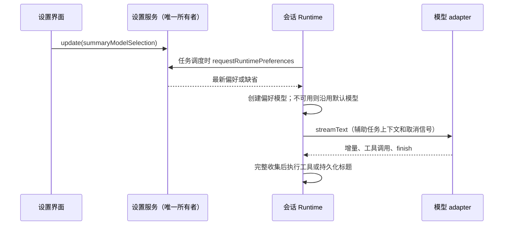

# 总结模型与后台流式结果

## 产品与所有权

- `AppSettings.summaryModelSelection` 由 Host 设置服务持久化，是全局偏好的唯一所有者；`null` 和字段缺省都表示跟随会话模型。
- 每次记忆提取、会话标题或目标标题任务调度时，通过既有 runtime preferences 反向请求读取最新偏好；Runtime 不缓存。已经调度的任务保留自己的模型和会话快照，下一次任务读取新设置。
- 子会话继承父会话的读取通道；旧记录或非协议宿主可以没有通道。启动偏好、记录和 Runtime 的回调类型均为可选。
- 标题保留既有默认优先级：显式 `titleGeneration.modelSelection`，然后会话当前模型。全局总结模型有效时优先使用它。
- Host 读取失败、偏好缺省或模型已删除时回到上述默认路径；不自动切换到无关 provider。真实模型网络请求失败仍按现有 adapter 重试和取消规则处理，不宣称任意失败都能完成总结。
- 总结模型旁复用子 Agent 页面的思考等级控件，候选及顺序只来自 Local Host ModelSelectionView。选择新模型时与子 Agent 一样保存该模型的完整选择（默认最高档），切换模型不携带旧模型档位；用户选择等级即保存到同一 `summaryModelSelection.options.reasoningLevel`，不新增设置所有者或协议。
- 选择“跟随会话模型”时清除整个总结模型偏好并隐藏等级控件，保留原来的最低档辅助调用行为。旧记录缺少等级时显示待选择状态，不把未保存的档位显示成已生效；模型缺失时隐藏等级，目录加载或读取失败时禁止写等级。单档模型沿用子 Agent 的固定档位展示。
- 模型与等级共用保存中禁用和失败提示，失败保留 Host 已保存值；无效档位不能从界面提交。目录中的档位失效时保留设置，不自动写回。

## 调用与流式边界

- 桌面和手机复用同一 Host 偏好入口；后台总结增量不进入桌面实时流或手机重放流，已有会话事件与标题持久化路径保持原有语义。
- 默认记忆模型必须保留快照的 `project_memory_extract` / `other` 调用上下文；选择其他模型时同步重新投影工具媒体能力。
- 总结偏好模型的标题与记忆提取请求使用其已保存的思考等级；记忆多轮工具调用每轮都保留该等级。缺省、失效偏好和 Host 失败的回退仍使用最低档，不继承聊天的高档位。其他辅助任务继续使用原来的最低档。
- 保留辅助请求的输出预算、准入、重试、取消和流式边界；新偏好只影响下一次任务，已调度的记忆快照保留原模型与等级。
- 收集器保留完整正文、推理块与签名、完整工具调用及最终用量；未收到 `finish`、错误结束或流抛错必须失败，不返回半成品、不执行已收集工具。
- 回退诊断只记录固定原因和操作分类，不记录原始异常消息、用户 provider/model 标识或凭据。
- 设置保存期间禁用选择器；失败显示可重试提示，保留服务端已有值，不产生未处理的 Promise 拒绝。
- 不迁移用户数据，不改变产品身份，不引入新的配置或传输机制。

## 验收

- CLI bootstrap 类型检查覆盖子会话可选回调，macOS arm64 CI 能完成准备与打包。
- 标题的偏好 provider 删除、Host 失败、清除偏好均回退正确；设置改变后同一 Runtime 下次生成使用新模型。
- 默认记忆与偏好记忆请求都保留辅助调用归因，完整流后才执行工具，错误或不完整流不会执行工具。
- 收集器覆盖分块正文、推理签名、多工具循环、错误和自然截断。
- UI 选择与恢复默认走同一设置写入路径，并覆盖持久化及失效模型展示。
- UI 验证新模型与等级选择、切换模型重置等级、恢复默认清除等级、单档展示、保存失败与保存中禁用、旧记录未选等级、目录加载/失败和模型删除；覆盖中文浅色、英文深色及窄屏布局。
- Runtime 验证标题和记忆每轮请求使用显式高档，默认/失效回退仍为最低档，偏好改变后同一 Runtime 下一次任务使用新等级。

UI 验收夹具：`node scripts/ci/summary-model-settings-fixture.mjs`，监听地址由输出给出。浏览器验证选择模型、恢复默认、保存期间禁用、保存拒绝后的提示与重试；`?locale=en-US&theme=dark&mode=deleted` 验证英文、深色及已删除模型展示。夹具仅使用虚构数据，验收后按 Ctrl-C 释放端口。
