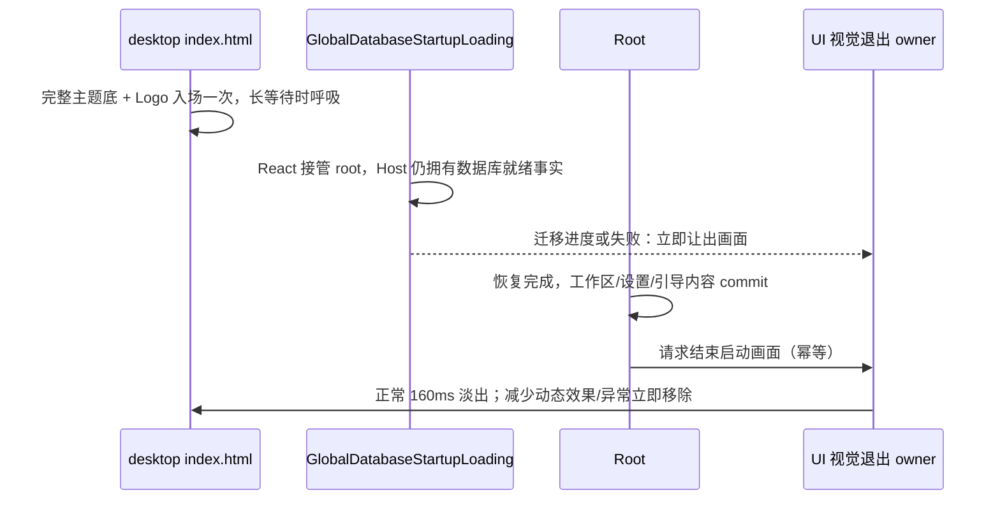

# ZCodium 启动标识一致性

## 产品规则

启动期间只允许出现**一段连续的品牌动效**，标记保持 ZCodium 珊瑚。桌面首帧有完整主题背景，
Logo 轻微回弹入场，等待较久时呼吸，实际内容就绪后淡出；不得重复播放入场或露出透明桌面。

1. **首帧启动画面**：`packages/desktop/src/renderer/index.html` 在 React bundle 执行前
   渲染同款 96px 居中图标与完整主题背景。画面放在 `#root` 外，数据库准备和工作区恢复
   不会替换该 DOM，因此 720ms 入场只播放一次；3 秒后以 1.8 秒周期轻微呼吸。
   `packages/web/index.html` 仍不渲染启动标记，只保留既有 bootstrap 主题背景。
2. **React 侧保留实际状态界面**：启动门禁阻塞期由 `RootStartupLoading`
   （`packages/ui/src/root/RootStartupLoading.tsx`）承接主题背景并渲染静态
   `ZCodeStartupLogoBadge`；数据库启动态由 `GlobalDatabaseStartupLoading` 的
   `DatabaseStartupSurface` 承接，**并渲染同一枚品牌标记**，失败态必须始终可操作。
3. **启动标记连续不闪**：持久的 HTML 画面覆盖静默数据库准备与 Root 门禁；底层状态页
   使用同款静态 Logo，不重新播放动效。主内容（工作区/设置/引导）实际 commit 后，用
   160ms 淡出让出主界面。没有强制最短停留时间，不等待 Logo 入场播放完。
4. **无障碍和异常优先**：系统 `prefers-reduced-motion: reduce` 禁止入场、呼吸和退场动效。
   数据库迁移进度、数据库失败、默认目录失败或 React 错误边界立即移除遮罩，确保重试、
   复制与退出操作可用；异常页面的 Logo 静止。独立更新窗口完全跳过启动画面。
5. **视觉层不控制启动**：不恢复 `zcode-react-startup-ready` 事件、超时假就绪或 `#root`
   透明度门禁。`StartupReadyNotifier` 仍只记录 T5；视觉结束幂等，不改变 Host、服务、
   CommandInbox、工作区恢复和远控协议。动画取消也会清理遮罩。
6. **品牌图标单一来源**：`ZCodeStartupLogoBadge` 与 `ZCodeAboutLogo` 共用同一枚
   `public/logo/icons/512x512.png`；desktop HTML 也通过 Vite 资源导入引用这同一枚文件，
   启动期不存在"两个珊瑚尺寸/来源不一致"。
7. **Linux 桌面条目唯一**：deep link 注册写入的用户级条目 id 必须是 `zcodium.desktop`，
   与 deb/rpm 安装的系统级条目同名，这样"系统级条目已存在就不写用户级"的遮蔽抑制才会生效；
   `Name`/`StartupWMClass` 取构建期产品身份（`desktop-product-identity.mjs`），不取 `app.name`。
   历史遗留且带归属标记的用户级 `zcode.desktop` 必须被清理，收敛成一个图标。

## 所有者与接口

- 桌面首帧标记：`packages/desktop/src/renderer/index.html` 拥有 `#root` 外的
  `#zcodium-startup-overlay`；`` 用**解析期即存在的静态 `src`** `/logo/icons/512x512.png`，
  指向 renderer publicDir 下的 `public/logo/icons/512x512.png`（仓库 `public/logo/icons/512x512.png`
  的副本），dev 由 Vite 直接 serve、生产由 Vite 拷贝进产物并按 base 重写。
  必须在解析期就有 `src`，脚本执行后再设 src 无法覆盖 bundle 下载/解析这段空档。
  更新状态窗口（`windowKind=update-status`）用同步脚本在解析期移除该标记。
- 启动画面：`packages/ui/src/root/RootStartupLoading.tsx`（门禁期）+
  `packages/desktop/src/renderer/src/main.tsx` 的 `GlobalDatabaseStartupLoading`（数据库期）。
  两者都自带 `bg-background`，都渲染 `ZCodeStartupLogoBadge`，启动期不再依赖 HTML 壳提供背景。
- 视觉退出唯一所有者：`packages/ui/src/root/startupPresentation.ts`，通过 UI 公开子入口
  `@zcode/ui/startup-presentation` 暴露幂等的 `finishStartupPresentation`。它只拥有 DOM 动画，
  不拥有业务就绪事实；没有持久化、服务请求或跨窗口事件。组件通过
  `StartupPresentationReady` 在内容 commit 时通知；数据库进度/失败和错误边界请求立即退出。
- 样式唯一来源：`@zcode/ui/startup-presentation.css`；桌面 HTML 与本地 Web 验收页复用。
  普通 Web 和手机远控保持现有入口语义，不新增桌面遮罩、Host 或动画恢复协议。
- 品牌图标：`packages/ui/src/root/ZCodeStartupLogoBadge.tsx` 与
  `packages/ui/src/components/ui/ZCodeAboutLogo.tsx` 引用同一枚
  `public/logo/icons/512x512.png`；空态水印用同一枚珊瑚的轮廓矢量
  （`packages/ui/src/v4/zcodiumWatermarkPath.ts`，由 `public/logo/watermark.png`
  的 alpha 描摹而来），以内联 SVG + `currentColor` 绘制。水印不得再退回位图蒙版：
  `mask-image` 指向 PNG 时，元素光栅化早于图片解码完成会只画出半截轮廓。
- 空态容器不得继承消息层的遮罩：`ConversationTimeline` 的两个分支
  （消息层 / 空态槽）必须各带自己的 `key`，否则 React 复用同一节点时会把
  `syncMessageLayerMask` 写下的内联遮罩留给空态，水印同样只剩半截。
- Linux deep link 条目：`packages/desktop/src/main/desktopLinuxDeepLinkRegistration.ts` 拥有
  文件 id、归属标记、Name/WMClass 与遗留清理；产品名由调用方
  `desktopOAuthDeepLink.ts` 从构建期身份模块（`packages/desktop/scripts/desktop-product-identity.mjs`）传入。
- 运行时应用名：`packages/desktop/src/main/desktopRuntimeEnv.ts` 的 `runtimeApplicationName`
  取构建期产品身份；`migrateRuntimeUserDataDir` 负责把旧名用户数据目录整体搬到新身份目录。

## 验收

1. 冷启动先显示主题底与 ZCodium Logo；HTML → 静默数据库准备 → Root 恢复始终是
   同一启动 DOM，入场仅一次，3 秒后呼吸；深浅色、系统主题和窄屏没有白闪或横向溢出。
2. 快启动不为动画等待；实际内容 commit 后即开始淡出。动画被取消、重复通知和后续
   工作区切换不会残留或重建遮罩；不改变真实启动耗时打点。
3. `packages/web/index.html` 不渲染启动标记；`windowKind=update-status` 窗口不显示首帧标记。
4. 减少动态效果开启时没有入场/呼吸/退场动画。不增加 `disableStartupAnimation` 设置项。
5. 迁移进度、数据库失败、默认目录失败与 React 异常立即露出；操作按钮可点击，重试不重播。
6. deb/rpm 安装后 `~/.local/share/applications` 不出现 `zcode.desktop`；已有遗留条目
   （带 `Comment=ZCode Desktop App` 归属标记）在下次启动被删除，用户手写条目不受影响。
7. `pnpm typecheck`、`pnpm lint`、`pnpm fmt:check`、`pnpm architecture:check --changed` 通过；
   `apps/zcode-cli` typecheck 通过。

## 本地效果验收

- `node scripts/ci/startup-animation-preview.mjs`：仅监听 `127.0.0.1`，输出预览地址，
  复用桌面 HTML、共享 CSS、真实数据库/Root 加载组件与退出接口；不连接真实用户数据库。
  可重播普通/快速/慢速启动、迁移、失败，以及切换深浅色和减少动态效果。
- `node scripts/ci/startup-animation-smoke.mjs`：自动覆盖上述浏览器场景、动画取消与重复通知；
  Chromium 路径可通过 `ZCODE_TEST_CHROMIUM_EXECUTABLE` 指定。
- 预览的加载时长是验收夹具模拟值；桌面生产流程继续完全由实际 Host 和 Root 状态驱动。
