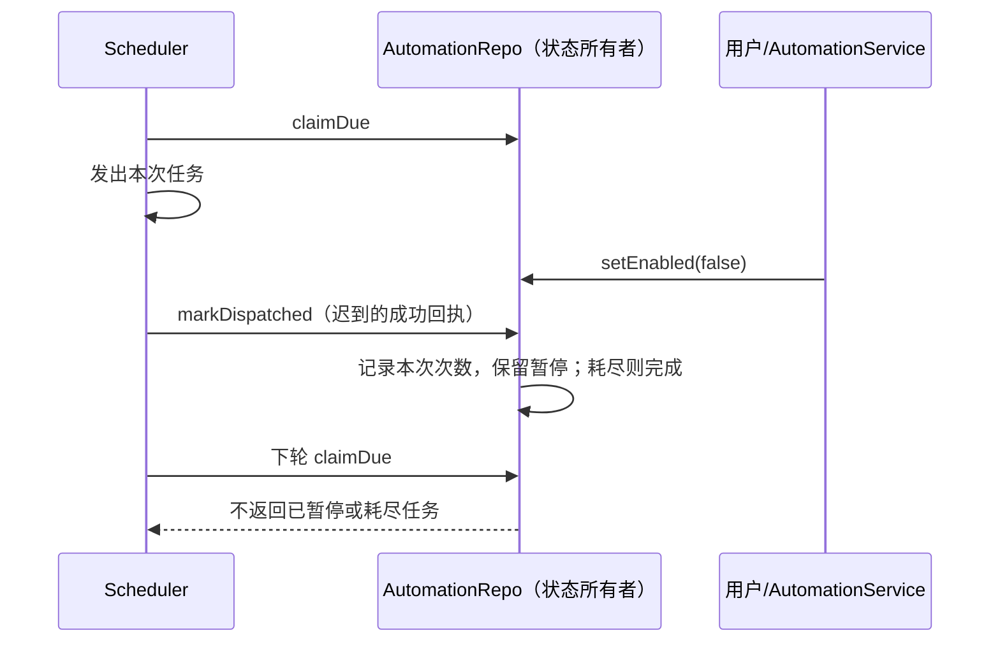

# 定时任务的暂停与执行上限

## 产品规则与所有者

- AutomationRepo 是持久化启用状态、生命周期、定时执行次数的唯一所有者；AutomationService 负责编辑规则，scheduler 只认领和结算派发。
- 用户暂停后，已经发出的本次派发可以完成，但成功回执不能恢复后续调度。达到次数或截止时间上限时仍进入 completed。
- 只修改截止时间不能解除已经耗尽的执行次数上限。只修改次数也不能解除截止时间限制；两个约束同时成立才允许恢复。
- 保留现有 workspace identity 隔离、manual run 计数语义和 claim/runId 边界；不新增状态库或调度路径。

## 接口与事件顺序

沿用 setEnabled、update、markDispatched 和 claimDue，不修改协议。

## 验收

- 真实 SQLite 两个连接模拟用户暂停与 scheduler 成功回执，后续 claimDue 不再认领；用户显式恢复后可正常认领。
- 暂停中的最后一次派发完成后进入 completed；manual run 不计入定时次数上限。
- 已耗尽任务仅延长/清除截止时间仍为 completed；未耗尽但因截止时间结束的任务延长期限可以恢复。
- 修改运行次数但截止时间仍不允许下一次运行时，不得恢复为 active。

无需数据迁移，现有桌面与手机只读取原有任务状态。验证使用隔离临时数据库，不派发真实模型请求。

## 验证结果

- Node 24.14.0 下 8 项 SQLite 回归通过，覆盖暂停/恢复、最后一次派发、截止时间修改、次数与日期约束、手动运行计数和 identity 隔离。
- 修复前已实际看到暂停和截止时间相关断言失败；修复后全部通过。新增测试单独完成类型检查。
- 经 `scripts/ci/automation-lifecycle.test.mjs` 接入现有 Release tests；未运行真实模型任务或完整定时任务页面 E2E。
