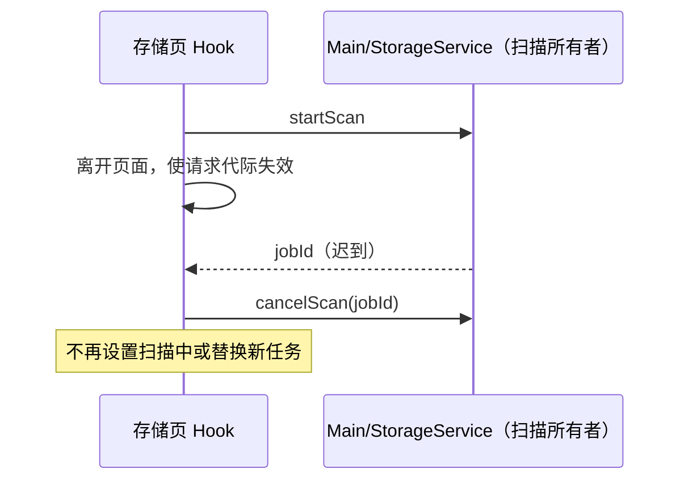

# 存储页扫描生命周期

## 产品规则与所有者

- Main 的 StorageService 继续拥有实际扫描任务；useStorageUsage 只拥有当前页面订阅与请求代际。
- 切走、卸载、失焦取消或新扫描取代旧扫描时，旧请求立即失效。旧 startScan 回应迟到后，必须按返回 jobId 取消，不能覆盖新页面的状态。
- 清理后的重新扫描仅在原页面代际仍有效时启动；清理操作本身按已有服务语义完成。
- 保留已知 jobId 的进度过滤与现有 60 秒失焦取消规则，不用延时解决请求顺序。

## 事件顺序

## 验收

浏览器交互场景使用真实 React Hook 和可控 preload bridge：进入后立即离开、离开后重新进入且回应乱序、卸载、迟到失败，以及清理完成前离开。断言失效任务被取消、新任务可接收进度、离开后不再启动扫描。该场景验证界面和 bridge 契约，不替代完整 Electron Worker 集成。

## 验证结果

- Windows Chrome 实际执行 `scripts/ci/storage-scan-lifecycle-smoke.mjs`，上述场景及等待启动期间失焦取消、扫描结束后的焦点切换均通过。
- 修复前“离开后迟到回应应取消”场景失败；修复后通过。60 秒规则使用浏览器虚拟时钟验证，没有缩短产品超时。
- 场景已接入 Desktop CI 的浏览器安装之后；本次没有打包或启动完整 Electron 安装版。
