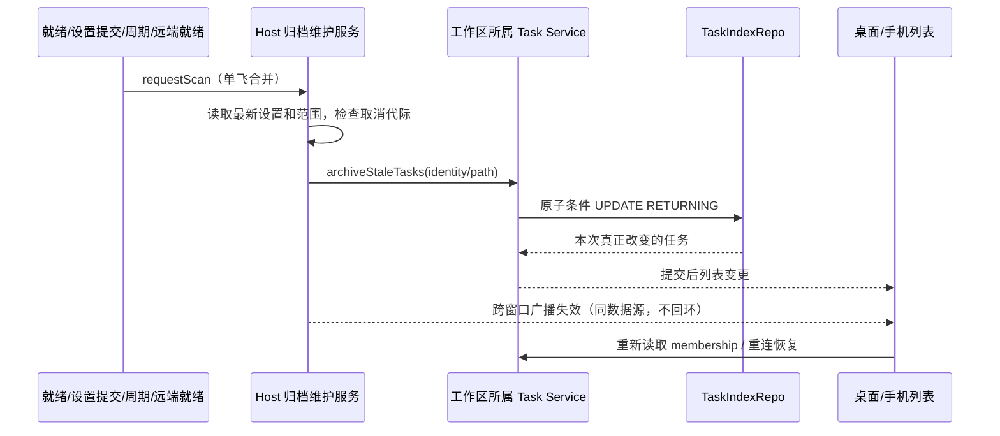

# 自动归档旧任务

## 产品规则

- 开关默认关闭，保留期默认 7 天；沿用设置校验范围和已有选项。
- 开启后，Host 服务就绪时扫描一次，此后每 30 分钟扫描。开启开关、修改保留期、最近项目或保存的工作区记录发生变化时立即补扫；远程工作区连接就绪后补扫。
- 扫描与侧栏视图、列表缓存、窗口是否正在显示任务无关。分组结构查询恢复为纯读取。
- 本地范围是 `recentProjects`（现有最近 10 个项目）、`lastWorkspaceSession` 中的本地工作区和 `getConversationWorkspaceDir()` 的并集。关闭项目标签不删除最近项目的扫描资格；普通对话即使不在最近项目列表中也被覆盖。不枚举整个文件系统、不启动 Agent。
- 远程范围来自保存的远程工作区记录，只通过当前窗口连接注册表中已就绪的对应 session 执行。必须同时匹配 identity、路径和当前 remoteSessionId；离线跳过，不能按路径回退本地或为了扫描建立连接。
- 候选必须同时满足：未删除、未归档、未置顶、无未读、状态 completed、最后更新时间严格早于保留期。包含隐藏的历史 provider；归档不删除会话内容、不修改最后更新时间。
- “已打开任务”不增加额外排除规则：旧实现也未提供该条件，唯一资格仍是上述持久化事实。

## 所有者与接口

| 状态                           | 唯一所有者                              | 访问方式                                                   |
| ------------------------------ | --------------------------------------- | ---------------------------------------------------------- |
| 设置及持久化工作区目录         | Setting service                         | get / 提交后 onDidUpdate                                   |
| 扫描定时器、单飞及取消代际     | 每个 Host 的 TaskAutoArchiveMaintenance | start / requestScan / dispose / disposeAndWait             |
| 远程连接身份和可用性           | WindowRemoteConnectionRegistry          | Host 注入解析函数，不把 Runtime 实现传入业务服务           |
| 任务归档状态                   | 所属数据源的 TaskIndexRepo              | 复用 IZCodeTaskService.archiveStaleTasks                   |
| 列表、membership、手机恢复投影 | 现有 syncer / Controller / 客户端       | 提交后 workspace_task_list_changed；重连重新读取持久化归属 |

维护服务属于 services/session，经 session contract 和 `@zcode/services/node` 公开装配边界；Main 只沿用广播转发，Renderer 不增加计时器或写入路径。desktop-attached-remote 服务不另起自主扫描器，其归档通过本地 Host 路由到远端现有 API。

## 时序、幂等与失败

- 每个 Host 最多一轮在途扫描；扫描期间新触发合并为一轮后续扫描，不累积命令队列。
- 跨 Host 的原子条件更新就是任务认领边界。相同数据源的重复调用只允许第一次返回该任务，避免先 SELECT 后按旧 ID 无条件 UPDATE 的竞争。不新增长期 lease 或第二份归档事实。
- 每个工作区执行前重读设置；设置提交使旧代际失效。关闭、改期或 dispose 后，不再提交尚未开始的归档。已经提交给远端/数据库的请求允许完成，不承诺撤销已提交操作。
- 维护器停止、注销监听并等待已提交请求完成后，才关闭数据库和任务服务。启动尚未完成的服务被释放时不能复活定时器。
- 单工作区失败记录 warn 并继续其他工作区；设置读取失败跳过本轮，下个周期重试。归档完成后通知失败不回滚数据库，重连/后续重新读取恢复权威状态。
- 跨窗口只广播数据源标识和工作区失效，不传播任务正文、路径日志或凭据；接收方校验负载和数据源，不再次广播。
- desktop-continuous 与 web-remote-replayable 保留既有投递和恢复协议；维护服务不产生新 session、Agent 或手机 Host。

## 验收与验证计划

| 编号  | 前置与动作                                    | 断言                                              | 证据                                        |
| ----- | --------------------------------------------- | ------------------------------------------------- | ------------------------------------------- |
| AA-01 | 默认项目视图，开启并启动 Host                 | 无任何 grouped 查询也会归档合格任务               | 服务集成测试                                |
| AA-02 | 保持应用运行，时间推进 30 分钟                | 新到期任务进入归档                                | 注入时钟/计时器测试                         |
| AA-03 | 修改保留期、开关、最近项目                    | 提交后补扫；关闭/旧代际不继续提交                 | 服务测试                                    |
| AA-04 | 已关闭标签的最近项目、普通对话                | 两者均覆盖，重复 scope 仅执行一次                 | 范围测试                                    |
| AA-05 | 已读/未读、置顶、运行、删除、已归档、边界时间 | 仅合格 completed 任务改变；更新时间不变           | 真实 SQLite 测试                            |
| AA-06 | 两个连接扫描同一数据库                        | 本次变更集合不重复，最新 pin/unread/status 被保护 | 多连接 SQLite 测试                          |
| AA-07 | 两个窗口同一数据源、另一个数据源              | 同源刷新，异源不污染、不回环                      | 广播集成测试                                |
| AA-08 | 同路径不同远端 identity、离线、重连           | 路由到正确 session，离线不回退，重连补扫          | 路由及维护测试                              |
| AA-09 | 单 scope 失败、扫描期间 dispose               | 其他 scope 继续；退出后无新扫描                   | 生命周期测试                                |
| AA-10 | 调用分组结构查询                              | 不改变任何任务归档状态                            | adapter 回归测试                            |
| AA-11 | 桌面实时订阅、手机断线后恢复                  | 实时通知和恢复读取都得到新归档集合                | 服务/Controller 集成测试，UI 场景待实际运行 |

UI E2E 场景：临时数据目录预置过期已读完成任务，保持默认项目视图，在设置打开归档；验证任务移至归档列表；第二窗口同步；手机断线期间归档后重连不重新显示活动任务。实际运行受 Electron/浏览器和现有测试入口可用性约束，不能把计划写成已执行。

## 本次验证记录

- 使用 `mise.toml` 指定的 Node 24.14.0，通过 `corepack pnpm` 执行检查。
- 新增 12 项测试全部通过：维护器、真实 SQLite、真实 task adapter、远程路由，以及本地/远程 Controller 的桌面增量帧与手机恢复快照。SQLite 测试包含精确到毫秒的保留期边界。
- 相关既有测试 14 项通过：历史会话恢复、已退役 ACP 边界、隐私日志和本地设置入口。
- 全仓库 `typecheck` 通过；新增 services 测试另行完成 TypeScript 检查。
- `lint`：0 错误，50 条既有警告；改动未新增警告。
- `architecture:check --changed`：0 违规；改动文件格式检查、Git whitespace 检查和新增功能图节点校验通过。
- 未执行完整 Electron 界面 E2E。以上 Controller / adapter 测试是服务与协议集成验证，不替代真实界面操作。
- 新增回归测试接入 Desktop CI，在构建前自动验证。
