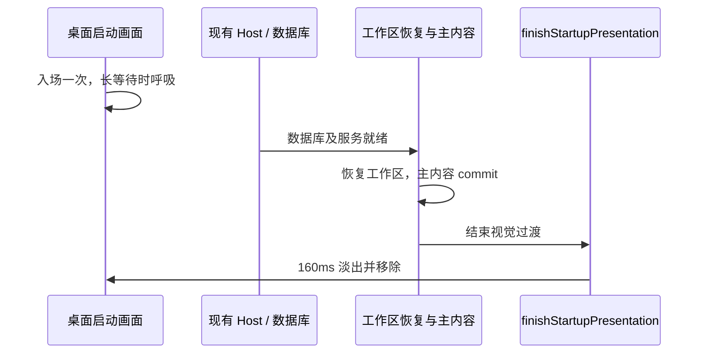

# 桌面启动动画

Windows/macOS 桌面启动保留 ZCodium 图标，恢复接近原版 ZCode 的动效：720ms 轻微缩放回弹，
等待超过 3 秒时以 1.8 秒周期轻微呼吸，实际主内容就绪后以 160ms 淡出进入工作区。

## 为什么不会重复播放

启动画面放在桌面 HTML 的 React `#root` 之外，数据库准备和工作区恢复不会重建该节点。
`RootStartupLoading` 与数据库页面保留静态同款图标，作为异常或无桌面遮罩入口的实际内容。
`StartupPresentationReady` 挂载在真实内容中，避免将 React 首次 commit 误认为工作区已就绪。



动画不参与业务门禁，不延迟初始化，也不设置“等待 N 秒就当作启动完成”的超时。
后续切换工作区和错误重试不会重建遮罩。原有主题偏好、启动耗时记录、Host 生命周期与
手机远控的恢复协议保持原有语义。

## 异常和无障碍

- 数据库升级进度、数据库失败、默认目录创建失败与 React 错误边界立即让出启动画面。
- 错误页面保持静态；重试、复制诊断信息与退出按钮可以直接操作。
- 遵循系统的“减少动态效果”，关闭入场、呼吸和退场动画，不新增应用设置。
- 独立更新状态窗口不展示启动动画。
- 首帧读取现有 `zcode-theme` 偏好，覆盖深色、浅色与跟随系统，避免主题跳变。

## 本地预览

按 `mise.toml` 使用 Node 24.14.0，依赖安装后从仓库根目录运行：

```sh
node scripts/ci/startup-animation-preview.mjs
```

浏览器打开输出的 `http://127.0.0.1:…` 地址。服务只绑定本机，按 Ctrl-C 结束。
页面可以重播普通、快速、慢速启动及升级、失败场景，支持深浅色和减少动态效果。
预览复用桌面 HTML、共享 CSS、实际加载组件及退出接口；工作区外观和耗时是演示夹具，
不会读取真实数据库、连接模型或启动 Agent。普通 Web 工作台和手机远控页面不因此增加桌面遮罩。

## 验证

```sh
corepack pnpm typecheck
corepack pnpm lint
corepack pnpm architecture:check --changed
node --test scripts/ci/startup-animation-assets.test.mjs scripts/ci/root-startup.test.mjs
node scripts/ci/startup-animation-smoke.mjs
node scripts/ci/root-startup-smoke.mjs
```

浏览器脚本使用 Playwright Chromium；可以通过 `ZCODE_TEST_CHROMIUM_EXECUTABLE` 指向已有 Chrome。
`root-startup-smoke.mjs` 沿用现有样式输入约定：默认读取桌面 renderer 产物中的 `styles-*.css`，
也可以用 `ZCODE_TEST_RENDERER_ASSETS` 指定包含当前编译样式的目录。
新增动效测试直接编译当前源码 CSS，无需本地桌面打包。

验收覆盖连续节点、长等待呼吸、快速退出、动画取消、重复完成、进度/错误恢复、深浅色、
窄屏、减少动态效果和更新窗口；Root 回归验证真实恢复门禁与首次进入工作区时退出动画。
HTML 资源测试用 Vite 生产模式确认共享样式和图标最终能解析为安装包内资源。

浏览器预览不验证 Electron 原生窗口显示时机、Windows 合成器或 macOS vibrancy；这部分需要
在对应平台安装包中另行验收。完整产品规则见 [启动标识规范](../.agents/specs/zcodium-startup-identity.md)。

### 本次验证记录（2026-10-08）

- Windows / Node 24.14.0 / 本机 Chrome：类型检查通过；Lint 为 0 错误、50 个现有警告；
  架构检查为 0 违规、0 新增。
- 启动门禁与生产资源测试 4/4 通过；动效浏览器场景、真实 Root 启动回归、Web 入口与
  WebSocket 回归通过。Web 回归固定英文浏览器 locale，消除 Windows 系统中文导致的按钮定位失败。
- 本次修改文件的格式检查通过。全仓 `fmt:check` 仍报告 2930 个未涉及本次改动的文件，
  未为此执行全仓格式化。
- 未在本机打包或验证 Windows/macOS 安装包；效果确认前不提交、不推送。
